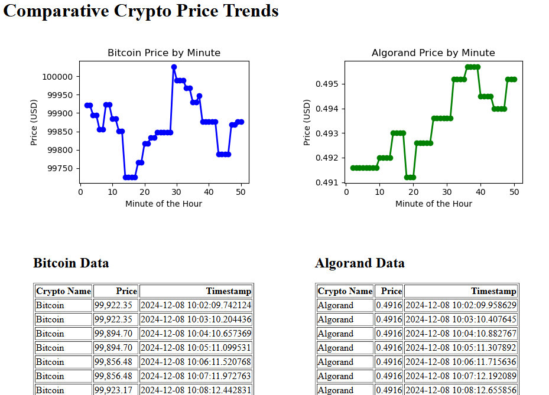

# Project Overview

This project is a Flask-based web application that scrapes cryptocurrency price data (Bitcoin and Algorand), visualizes trends over time, and serves the data through a web interface and a JSON API.

## Tools and Technologies Used
- **Python**:
  - **Requests**: For fetching HTML content from cryptocurrency websites.
  - **BeautifulSoup**: For parsing and extracting data from HTML.
  - **Pandas**: For storing and manipulating the scraped data.
  - **Matplotlib**: For generating visualizations of cryptocurrency trends.
- **Flask**: For creating the web application and serving data through an API.
- **Threading**: For running the scraper and web server concurrently.

## Structure
- **Web Scraping**:
  - Fetches cryptocurrency data (name, price, and timestamp) from CoinMarketCap for Bitcoin and Algorand.
  - Stores data in a Pandas DataFrame for further processing and visualization.
- **Data Visualization**:
  
  - Generates line charts for each cryptocurrency, showing price changes over time.
  - Charts are embedded into the web interface using Base64 encoding.
- **Flask Web Application**:
  - `/`: Displays interactive visualizations and tabular data for Bitcoin and Algorand.
  - `/data`: Provides the scraped data in JSON format.
- **Threading**:
  - Runs the data scraper at regular intervals (default: 60 seconds) while simultaneously hosting the Flask web application.

## Key Features
- Automated data scraping for real-time cryptocurrency price updates.
- Dynamic visualizations for analyzing trends by minute or hour.
- Interactive web interface for viewing trends and tabular data.
- JSON API endpoint for programmatic access to the data.
